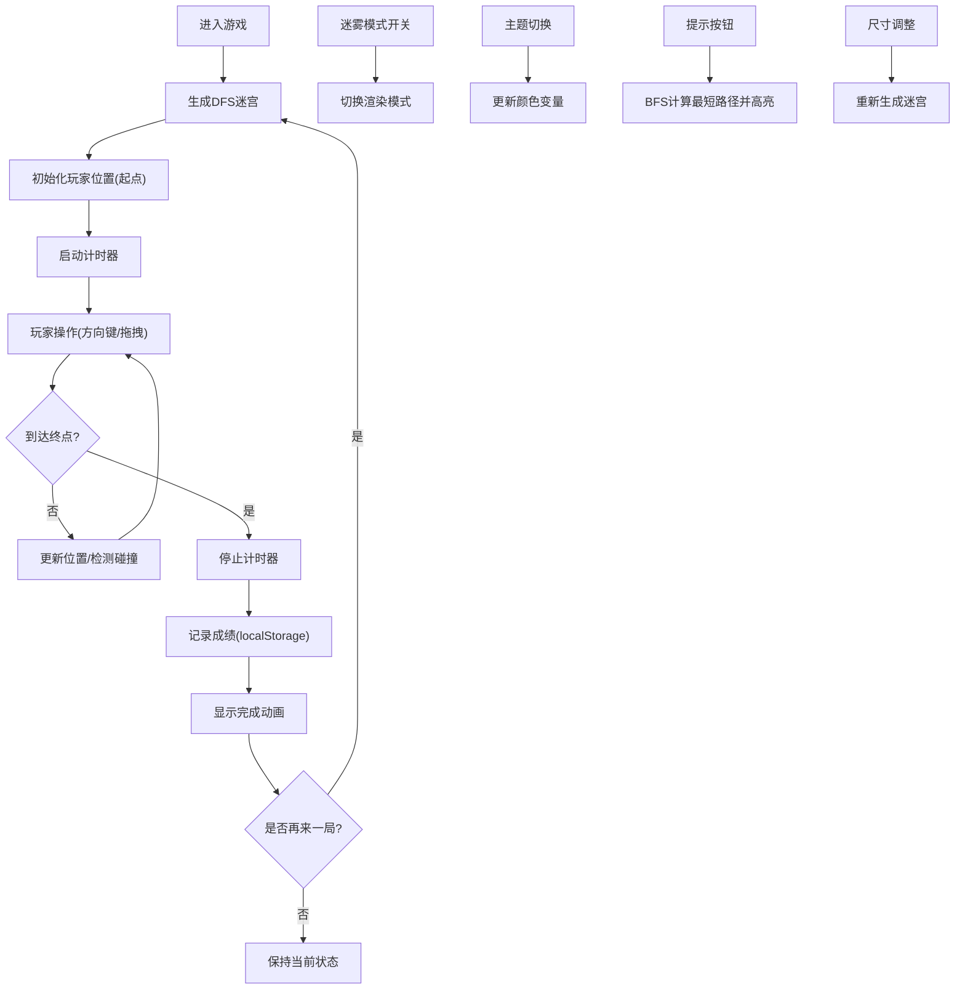

## 1. 产品概述

一款基于Web的迷宫逃脱小游戏，玩家控制小球在随机生成的迷宫中从起点移动到终点。游戏融合经典解谜与现代视觉效果，提供多样化的游戏模式和个性化选项。

- 核心目标：通过最短时间逃离迷宫，挑战自我记录
- 目标用户：休闲游戏爱好者、解谜游戏玩家
- 产品价值：提供轻松有趣的脑力挑战，兼具视觉美感和游戏性

## 2. 核心功能

### 2.1 用户角色

| 角色 | 注册方式 | 核心权限 |
|------|----------|----------|
| 玩家 | 无需注册，本地存储记录 | 开始游戏、调整设置、查看记录 |

### 2.2 功能模块

1. **游戏主界面**：迷宫画布、玩家小球、起点终点标记、计时器
2. **控制面板**：迷宫尺寸选择、迷雾模式开关、主题切换、提示按钮、重新开始
3. **小地图**：迷宫俯视图、实时显示当前位置
4. **记录系统**：最佳成绩存储与展示

### 2.3 页面详情

| 页面名称 | 模块名称 | 功能描述 |
|----------|----------|----------|
| 游戏主页面 | 迷宫画布 | Canvas渲染迷宫、玩家移动动画、墙壁碰撞检测 |
| 游戏主页面 | 控制面板 | 尺寸滑块(10-30)、迷雾模式开关、主题下拉选择、提示按钮、重新开始按钮 |
| 游戏主页面 | 小地图 | 右上角缩略图显示迷宫全貌和玩家位置 |
| 游戏主页面 | 信息面板 | 计时器显示、当前成绩、历史最佳成绩 |
| 游戏主页面 | 路径提示 | BFS计算最短路径并高亮显示 |
| 游戏主页面 | 迷雾效果 | 只显示玩家周围5格范围，其余区域雾化 |

## 3. 核心流程

## 4. 用户界面设计

### 4.1 设计风格

**设计方向：赛博朋克霓虹风格**

- **主色调**：深紫色背景 (#0a0a1a)，霓虹青色 (#00f5ff)，霓虹粉色 (#ff00ff)
- **辅助色**：荧光绿 (#39ff14) 用于玩家，琥珀色 (#ffb000) 用于路径提示
- **按钮风格**：霓虹发光边框，圆角，悬停时有脉冲动画
- **字体**：显示字体使用 "Press Start 2P"（像素风），正文字体使用 "JetBrains Mono"
- **布局风格**：左侧大迷宫画布，右侧控制面板和信息区，右上角悬浮小地图
- **视觉效果**：背景网格渐变、霓虹发光效果、扫描线覆盖层、数字雨粒子背景

### 4.2 页面设计概览

| 页面名称 | 模块名称 | UI元素 |
|----------|----------|--------|
| 游戏主页面 | 迷宫画布 | Canvas渲染，带发光边缘的墙壁，圆形发光小球玩家，发光起点终点标记 |
| 游戏主页面 | 控制面板 | 玻璃拟态卡片，霓虹滑块，发光开关按钮，下拉选择器 |
| 游戏主页面 | 小地图 | 半透明背景，缩略迷宫，闪烁的玩家位置标记 |
| 游戏主页面 | 信息面板 | 大数字计时器，霓虹发光的"最佳记录"标签 |
| 游戏主页面 | 提示效果 | 闪烁的琥珀色路径光点，从玩家指向终点 |
| 游戏主页面 | 迷雾效果 | 径向渐变蒙版，边缘雾化处理 |

### 4.3 响应式设计

- **桌面优先**：1200px以上完整布局，左侧迷宫(70%) + 右侧面板(30%)
- **平板适配**：768-1200px，上下布局，迷宫在上，面板在下
- **移动适配**：768px以下，迷宫占满屏幕，控制面板可折叠
- **触摸优化**：支持触屏滑动控制，按钮尺寸增大便于点击

### 4.4 视觉动效

- **页面加载**：迷宫逐行扫描显示，控制面板从右侧滑入
- **玩家移动**：平滑过渡动画，带拖尾效果
- **按钮悬停**：霓虹脉冲发光，轻微放大
- **完成游戏**：彩色粒子爆炸，玩家小球变成彩虹色
- **提示路径**：路径点依次闪烁出现，形成流动效果
- **迷雾切换**：渐变过渡，雾化边缘动态变化
