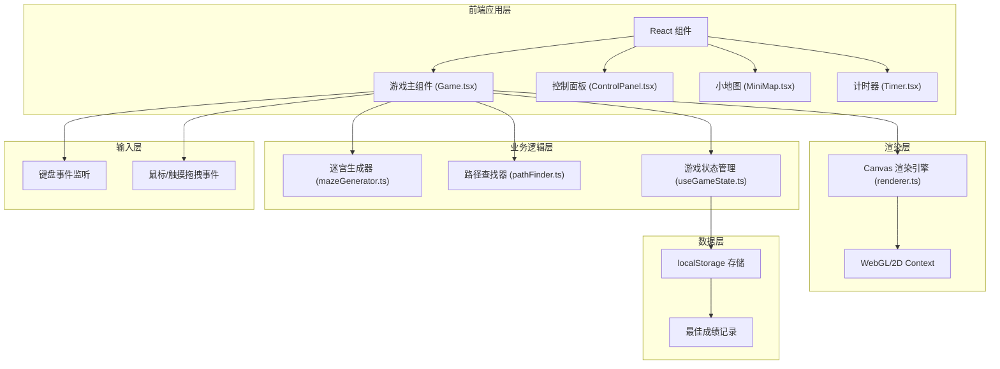

## 1. 架构设计



## 2. 技术描述

- **前端框架**：React@18 + TypeScript
- **构建工具**：Vite@5
- **样式方案**：TailwindCSS@3 + CSS Variables
- **渲染技术**：HTML5 Canvas 2D
- **状态管理**：React Hooks (useState, useEffect, useRef, useCallback)
- **图标**：Lucide React
- **字体**：Google Fonts (Press Start 2P, JetBrains Mono)

## 3. 项目结构

```
src/
├── components/
│   ├── Game.tsx              # 游戏主组件
│   ├── ControlPanel.tsx      # 控制面板
│   ├── MiniMap.tsx           # 小地图
│   ├── Timer.tsx             # 计时器显示
│   └── ThemeSelector.tsx     # 主题选择器
├── hooks/
│   ├── useGameState.ts       # 游戏状态管理
│   └── useKeyboard.ts        # 键盘事件Hook
├── utils/
│   ├── mazeGenerator.ts      # DFS迷宫生成算法
│   ├── pathFinder.ts         # BFS路径查找算法
│   ├── renderer.ts           # Canvas渲染函数
│   └── storage.ts            # localStorage操作
├── types/
│   └── game.ts               # 类型定义
├── themes/
│   └── themes.ts             # 主题配置
├── App.tsx
├── main.tsx
└── index.css
```

## 4. 核心数据类型定义

```typescript
// 迷宫单元格
interface Cell {
  x: number;
  y: number;
  walls: {
    top: boolean;
    right: boolean;
    bottom: boolean;
    left: boolean;
  };
  visited: boolean;
}

// 玩家位置
interface Position {
  x: number;
  y: number;
}

// 游戏状态
interface GameState {
  maze: Cell[][];
  mazeSize: number;
  playerPos: Position;
  startPos: Position;
  endPos: Position;
  isPlaying: boolean;
  isComplete: boolean;
  elapsedTime: number;
  bestTime: number | null;
  fogMode: boolean;
  currentTheme: string;
  showPath: boolean;
  hintPath: Position[];
}

// 主题配置
interface Theme {
  name: string;
  background: string;
  wallColor: string;
  wallGlow: string;
  playerColor: string;
  playerGlow: string;
  startColor: string;
  endColor: string;
  pathColor: string;
  fogColor: string;
}
```

## 5. 核心算法

### 5.1 DFS迷宫生成算法

```typescript
function generateMaze(size: number): Cell[][] {
  // 1. 初始化迷宫网格，所有墙壁都存在
  // 2. 选择起点单元格，标记为已访问
  // 3. 使用递归回溯法：
  //    - 随机选择一个未访问的邻居
  //    - 移除当前单元格与邻居之间的墙壁
  //    - 将邻居标记为已访问并入栈
  //    - 如果没有未访问邻居则回溯
  // 4. 直到所有单元格都被访问
}
```

### 5.2 BFS最短路径查找

```typescript
function findShortestPath(
  maze: Cell[][], 
  start: Position, 
  end: Position
): Position[] {
  // 1. 使用队列进行广度优先搜索
  // 2. 记录每个单元格的父节点
  // 3. 从终点回溯到起点得到路径
  // 4. 返回路径坐标数组
}
```

### 5.3 碰撞检测

```typescript
function canMove(
  maze: Cell[][], 
  pos: Position, 
  direction: 'up' | 'down' | 'left' | 'right'
): boolean {
  // 检查目标方向是否有墙壁
  // 检查是否越界
}
```

## 6. 路由定义

| 路由 | 页面 | 用途 |
|------|------|------|
| / | 游戏主页 | 唯一页面，包含所有游戏功能 |

## 7. 性能优化策略

1. **Canvas渲染优化**：
   - 使用requestAnimationFrame进行动画帧同步
   - 仅在玩家移动或状态变化时重绘
   - 离屏Canvas预渲染迷宫墙壁

2. **状态更新优化**：
   - 使用useRef存储频繁更新的游戏状态
   - 避免不必要的React重渲染
   - 计时器使用独立的requestAnimationFrame循环

3. **内存优化**：
   - 迷宫生成后及时清理临时数据
   - 路径提示使用后立即清空
   - 事件监听器在组件卸载时正确移除

## 8. 主题配置

```typescript
const themes: Theme[] = [
  {
    name: '赛博朋克',
    background: '#0a0a1a',
    wallColor: '#00f5ff',
    wallGlow: '#00f5ff',
    playerColor: '#39ff14',
    playerGlow: '#39ff14',
    startColor: '#ff00ff',
    endColor: '#ff00ff',
    pathColor: '#ffb000',
    fogColor: 'rgba(10, 10, 26, 0.95)',
  },
  {
    name: '复古像素',
    background: '#1a1a2e',
    wallColor: '#e94560',
    wallGlow: '#e94560',
    playerColor: '#0f3460',
    playerGlow: '#16213e',
    startColor: '#533483',
    endColor: '#533483',
    pathColor: '#f5f5f5',
    fogColor: 'rgba(26, 26, 46, 0.95)',
  },
  {
    name: '森林绿意',
    background: '#1b4332',
    wallColor: '#95d5b2',
    wallGlow: '#74c69d',
    playerColor: '#ffd60a',
    playerGlow: '#ffc300',
    startColor: '#e63946',
    endColor: '#e63946',
    pathColor: '#d8f3dc',
    fogColor: 'rgba(27, 67, 50, 0.95)',
  },
  {
    name: '深海幽暗',
    background: '#03045e',
    wallColor: '#00b4d8',
    wallGlow: '#0096c7',
    playerColor: '#caf0f8',
    playerGlow: '#ade8f4',
    startColor: '#90e0ef',
    endColor: '#90e0ef',
    pathColor: '#48cae4',
    fogColor: 'rgba(3, 4, 94, 0.95)',
  },
];
```
